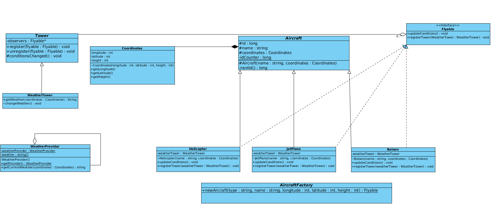

You will have to implement a minimal aircraft simulation program based on a given UML class diagram. This project will introduce to you the concept of UML class diagrams and object oriented design patterns, all implemented in the Java language.

## BONUS :
- [x] MD5
- [x] GUI With JFC/Swing

# Objectives :
- Java
- UML
- Object-Oriented Programming
- Imperative Programming

# Skills :
- Object-oriented programming
- Rigor
- Imperative programming
- Adaptation & creativity

